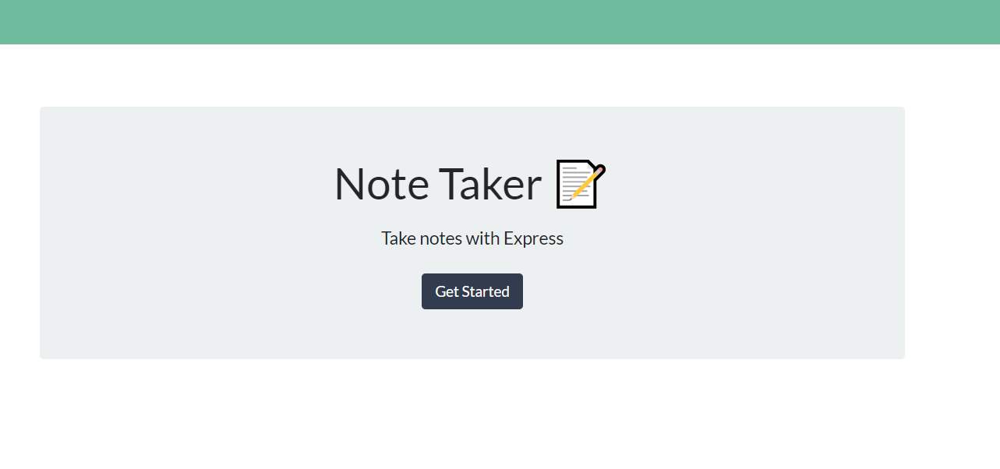

  
  
  
  
  
# Introduction: Note Taker

## Instructions

Create an application that can be used to write, save, and delete notes. 
This application will use an express backend and save and retrieve note data from a JSON file.

## Documentation

  * GET `/api/notes`: Shows all the notes from db.json file

  * POST `/api/notes` : POST request from server side with Postman

  * DELETE `/api/notes/:id` : DELETE request from server side with Postman

## Screenshot 

## Getting Started

* Open the folder with Visual Code.
* Create a json file with the command npm init -y or npm init.
* Open terminal and run the command npm install. 
* Documentation express npm package - https://www.npmjs.com/package/express

## Built With

- HTML5 
- CSS
- JavaScript
- Node.js - express npm
- Postman - to check POST and DELETE request

## Authors

- Philip Kouchner
- Github link -  https://github.com/PhilipK-webdev/Node_Taker
- Heroku link - https://node-taker-serverside.herokuapp.com/